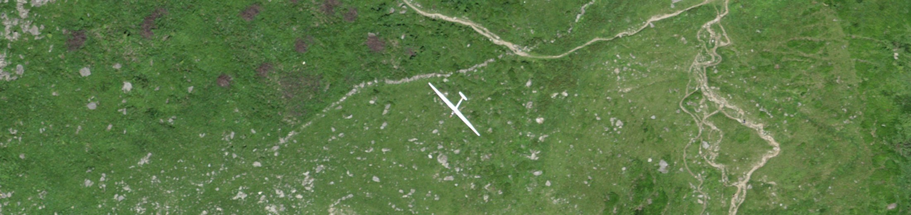
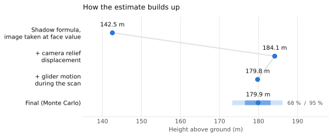
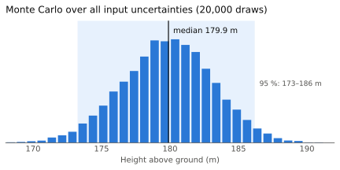
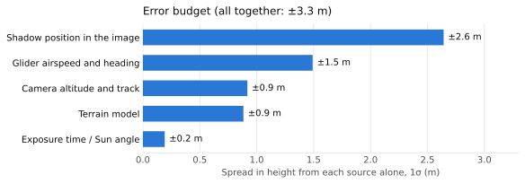

# Height estimate: a glider from its shadow



A SWISSIMAGE aerial orthophoto near Isenau, Switzerland shows a glider and, 76 m away, its shadow on the hillside. This repository works out how high the glider was from that one image.

**[Read the write-up (PDF)](paper/height-estimate.pdf)**: the method, the maths and every check, step by step.

## Result

**The glider was 180 ± 3 m above the ground beneath it** (median 179.9 m; 95% interval 173–186 m).

| Step | Height |
|---|---:|
| Shadow formula, image positions taken at face value | 142.5 m |
| + camera relief displacement (the orthophoto draws the glider ~20 m too far north, towards its shadow) | 184.1 m |
| + glider motion while the pushbroom scanner swept from the shadow to the glider | 179.8 m |
| Monte Carlo over all input uncertainties | 179.9 ± 3.3 m |

<picture>
  <source media="(prefers-color-scheme: dark)" srcset="docs/estimate-steps-dark.svg">
  
</picture>

<picture>
  <source media="(prefers-color-scheme: dark)" srcset="docs/estimate-distribution-dark.svg">
  
</picture>

## How

1. **Measure the image.** Locate the glider's silhouette centroid. Find its faint shadow by matching a sun-blurred copy of the silhouette (5.8σ peak).
2. **Shadow geometry.** h = D·tan α + z_shadow − z_ground, with the terrain from swissALTI3D.
3. **Reconstruct the camera.** The flight strip's footprint narrows over mountains and widens over Lake Geneva. Fitting that across 56 cross-sections recovers the camera's field of view, 45.3°, which matches the Leica ADS100 SH120 datasheet value of 45.2°. It also gives the flight altitude, 6393 m, and the nadir track, which ran 481 m south of the glider. The orthophoto therefore drew the airborne glider displaced 20 m north. Correcting for that is the largest single change, +30%.
4. **Date the exposure.** That morning's nine survey strips give the aircraft's ground speed, which dates the exposure over the glider to 11:25:09 UTC ± 55 s. The Sun's elevation was then 65.19°.
5. **Check.** The corrected shadow direction alone dates the exposure to 11:26:35, within 1.5 minutes of the flight-log estimate. The geometry closes to about 1 m.

The largest remaining uncertainty is where the faint shadow sits along the wing axis (σ_h ≈ 2.6 m). Next come the unknown glider airspeed (1.5 m), the camera geometry (0.9 m) and the terrain (0.9 m).

<picture>
  <source media="(prefers-color-scheme: dark)" srcset="docs/error-budget-dark.svg">
  
</picture>

## Contents

| Path | What |
|---|---|
| `paper/` | LaTeX write-up (`height-estimate.tex` / `.pdf`), figure, `solar.mjs` (solar position) |
| `analysis/measure_image.py` | Glider and shadow centroids from the swisstopo WMS imagery |
| `analysis/fit_camera.py` | Field of view, flight altitude, nadir track and exposure time from strip metadata |
| `analysis/solve_height.py` | Full geometric model, Monte Carlo and error budget |
| `analysis/plot_figures.py` | README charts (light and dark SVG) |
| `data/` | Cached strip metadata, strip-edge terrain, local terrain grids, `estimate.json` (solver output) |
| `glider-height/` | Static browser calculator and tested JavaScript module for the basic formula ([details](glider-height/README.md)) |
| `docs/` | Banner, README charts and calculator screenshots |

## Reproduce

```sh
uv run --with numpy --with scipy --with pillow python analysis/measure_image.py
uv run --with numpy python analysis/fit_camera.py
uv run --with numpy --with scipy python analysis/solve_height.py
node paper/solar.mjs
cd paper && tectonic height-estimate.tex      # or any XeLaTeX/LuaLaTeX
cd glider-height && npm test && npm start     # calculator at http://localhost:8000
```

Requirements are Python 3 with numpy, scipy and Pillow, plus Node.js ≥ 18. The analysis runs offline from the cached files in `data/`. Only `measure_image.py` needs network access, for the imagery.

## Status

This is a finished one-off case study and is not actively maintained.

Imagery, flight metadata and terrain © swisstopo (free use with attribution). The banner and figure crops come from SWISSIMAGE. Code and text are under the [MIT License](LICENSE).
